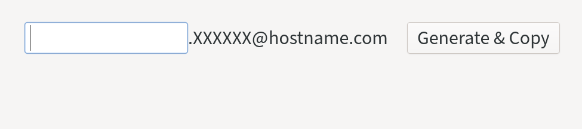

# `gen-alias`

Generate [Fastmail-style masked emails](https://www.fastmail.com/blog/masked-email-from-fastmail-and-1password-protects-your-identity-online/).

I use [Fastmail](https://fastmail.com) for emails.
I think their masked email offering is a good idea, but I can't use it because it only works with 1Password (I use [KeepassXC](https://keepassxc.org/) for password management).
`gen-alias` is a reasonable offline approximation.
